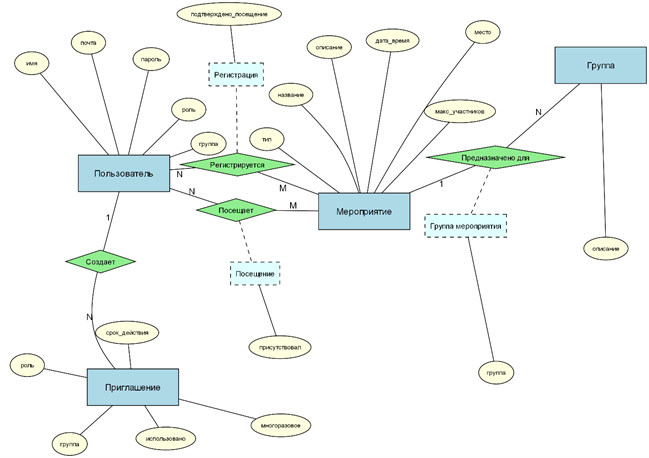
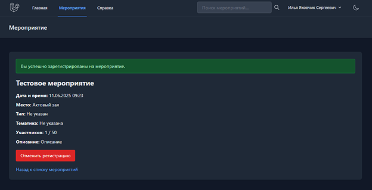

# 🌐 Event Tracker Web Application

> **A web application for planning, systematizing, and tracking student attendance at cultural and educational events.**

 

## 🎯 Overview

The **Event Tracker Web Application** is designed to streamline the management of cultural and educational events for educational institutions. It provides a centralized platform for event planning, student registration, and automated attendance tracking, significantly improving the organization and reporting of extracurricular activities.

### ✨ Key Features

- 🔐 **Authentication & Authorization** - Secure login system with role-based access (Administrator, Curator, and Student).
- 📅 **Event Management** - View, filter, edit, and add upcoming events (date, time, location, description, max participants).
- 📝 **Student Registration** - Students can sign up for events and cancel their registration before the start.
- 🔔 **Email Notifications** - Automated email reminders for upcoming events and password recovery.
- 📊 **Attendance Tracking** - Automatic registration of attendance (via QR code) and history viewing for students.
- 📈 **Reporting & Analytics** - Generate statistical reports on attendance by group, event type, and time period.
- 📤 **Data Export** - Functionality to export stored data and reports (PDF, Word, Excel).
- 📱 **Adaptive Design** - Responsive layout for correct display on modern browsers and devices.

## 🛠️ Technology Stack

The application is built using a modern, robust web development stack:

| Component | Technology | Version/Details |
|---|---|---|
| **Backend Framework** | Laravel | Used for business logic, controllers, and models. |
| **Backend Language** | PHP | 8.3.1 |
| **Database** | MySQL | 5.7.24 |
| **Web Server** | Apache/Nginx | Handles HTTP/HTTPS requests. |
| **Frontend** | Blade Templates | Used for the user interface (Views). |
| **Caching/Queue** | Redis, Memcached | Used for optimization and asynchronous tasks (e.g., notifications). |
| **Email Service** | SMTP (Gmail) | Used for notifications and password recovery. |

## 📋 Core Functionality

### 🔑 Authentication and User Roles

- **Secure Login:** User authentication with username and password.
- **Password Recovery:** Via email for students.
- **Role-Based Access:** Separate interfaces and permissions for **Administrator**, **Curator**, and **Student**.

### 📅 Event Management (Administrator/Curator)

- **Event CRUD:** Create, Read, Update, and Delete events.
- **Filtering:** Filter events by date, type, and theme.
- **Details:** Specify date, time, location, description, and maximum number of participants.

### 📝 Student Interaction (Student)

- **Event Listing:** View a list of upcoming events.
- **Filtering:** Filter events by date, type, and theme.
- **Registration:** Sign up for an event.
- **Cancellation:** Cancel registration before the event starts.
- **History:** View personal attendance history.

### 📊 Reporting and Analytics

- **Attendance Analysis:** Analyze attendance by various criteria (e.g., by student group, event type).
- **Statistical Reports:** Generate reports for the administrator, including event statistics and total visits over a selected period.
- **Data Operations:** Provide capabilities for viewing, searching, sorting, and filtering all stored information.

## 🏗️ System Architecture

The application follows a standard web application architecture, likely a **Three-Tier Architecture** or a **Client-Server Model**. The system's structure and data flow are detailed in the following diagrams:

| Diagram | Description | Image |
|---|---|---|
| **Use Case Diagram** | Describes the interaction of users (Administrator, Curator, Student) with the system. |  |
| **Entity-Relationship Diagram** | Reflects the logical structure of the database, showing key entities and their relationships. |  |
| **Deployment Diagram** | Illustrates the physical deployment architecture (Client, Web Server, PHP/Laravel, MySQL). |  |

The architecture ensures data storage, user authentication, business logic execution, and a responsive user interface. This is only a small part of the overall system functionality.

## 💾 Database Schema

The system uses a relational database (MySQL) to store and manage all application data. Key entities include:

| Entity | Russian Name | Key Attributes |
|---|---|---|
| **User** | Пользователь | Name, Email, Password, Role, Group |
| **Event** | Мероприятие | Title, Description, Date/Time, Location, Max Participants, Type |
| **Registration** | Регистрация | User ID, Event ID, Confirmation Status |
| **Attendance** | Посещение | User ID, Event ID, Fact of Attendance |
| **Group** | Группа | Description |
| **Invitation** | Приглашение | Role, Group, Usage Status, Expiration Date |

## 📸 Screenshots

Here are some screenshots illustrating key user flows and interface elements:

| Screenshot | Description |
|---|---|
|  | **Registration Page** with filled input fields. |
|  | **Student Home Page.** |
|  | Result of an attempt to register with an **invalid token**. |
|  | **Create Event Page** with necessary input fields filled. |
|  | **Detailed Event Information Page.** |
|  | Result of a student attempting to access the **Create Event Page**. |
|  | **Create Invitation Page.** |
|  | Result of a **successful invitation creation.** |
|  | **Detailed Event Information Page for a student.** |
|  | Result of a **successful event registration by a student.** |
|  | Result of a student attempting to access the **Analytics and Reports Page**. |

## 🔧 System Requirements

The web application must meet the following requirements:

- **Browser Compatibility:** Correct display in the latest versions of modern web browsers.
- **Adaptive Layout:** Responsive design for various screen sizes (desktop, tablet, mobile).
- **Server:** Hosting environment capable of running the chosen backend technology and database.
- **Email Service:** Integration with an email service for notifications and password recovery.

## 🤝 Contributing

Contributions are welcome! Please feel free to submit a Pull Request or open an Issue.

**⭐ If you find this project useful, please consider giving it a star!**

